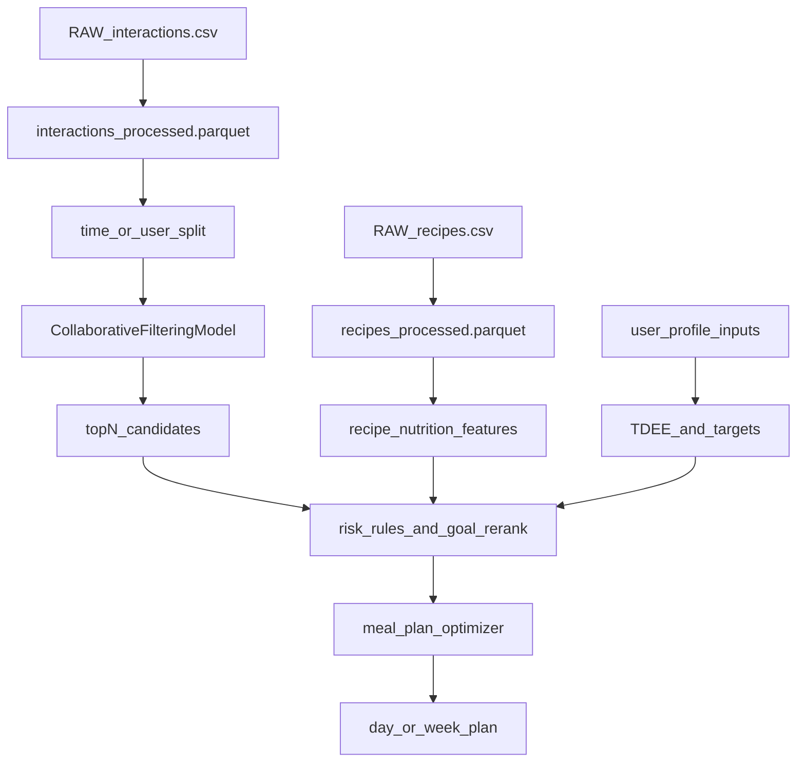

## Mục tiêu
- Train được mô hình gợi ý **candidate recipes** theo `user_id` từ `RAW_interactions.csv`.
- Xây lớp **goal/profile-aware re-ranker + meal-plan generator** để tạo **thực đơn ngày/tuần** đáp ứng target năng lượng/macros theo **giảm cân / tăng cân / giữ cân**.
- Xuất artifacts để sau này dựng UI/API: model weights, mapping id↔index, feature store (nutrition), và hàm infer.

## Definition of Done (để coi là “hoàn thiện phase train AI”)
- Có thể chạy 1 lệnh/notebook để:
  - Tạo `data/processed/` (recipes + interactions đã chuẩn hoá).
  - Train model và lưu artifacts vào `artifacts/`.
  - Generate thực đơn (ngày/tuần) cho 1 `user_profile` mẫu + goal.
- Có báo cáo đánh giá offline:
  - Retrieval: `Recall@K`, `NDCG@K` theo split.
  - Meal-plan: % ngày đạt calories band, protein coverage, runtime.
- Có hàm infer “1 phát ra thực đơn” ổn định để UI/API gọi sau.

## Bối cảnh repo hiện tại
- Repo mới có notebook EDA/cleaning: [notebooks/01_data_exploration.ipynb](notebooks/01_data_exploration.ipynb), [notebooks/02_data_cleaning.ipynb](notebooks/02_data_cleaning.ipynb).
- Dữ liệu nền:
  - `RAW_recipes.csv`: có `nutrition` tách ra các cột `calories`, `fat`, `sugar`, `sodium`, `protein`, `saturated_fat`, `carbs` (đã làm trong notebook).
  - `RAW_interactions.csv`: `user_id`, `recipe_id`, `rating`, `review`, `date`.
- Chưa có module code/backend; plan sẽ đề xuất cấu trúc tối thiểu để train/tái sử dụng.

## Thiết kế hệ thống (train/infer)
### Luồng dữ liệu & mô hình

### Thành phần 1: Data processing
- **Recipes**
  - Parse `nutrition` (7 phần tử) thành các cột số.
  - Chuẩn hoá `ingredients`, `tags` nếu cần làm content features.
  - Lưu `recipes_processed` (parquet) và `recipe_id` index map.
- **Interactions**
  - Làm sạch duplicates/null, chuẩn hoá rating (vd 1–5).
  - Tạo implicit signal (vd `rating>=4` là positive) hoặc giữ explicit.
  - Lưu `interactions_processed` và `user_id`/`recipe_id` index map.

### Thành phần 2: Candidate recommender (train “AI”)
Chọn 1 hướng chính (ưu tiên đơn giản, chạy được nhanh):
- **Implicit ALS (recommended)** nếu bạn muốn top-N mạnh cho retrieval.
  - Train trên user×recipe sparse matrix từ `interactions_processed`.
  - Output: `user_factors`, `item_factors`, và hàm `recommend(user_id, N)`.
- Fallback: **Surprise SVD** (explicit rating) nếu bạn muốn dự đoán rating.

Artifacts cần xuất:
- `model/` (weights)
- `mappings/` (`user_id_to_index.json`, `recipe_id_to_index.json`)
- `data/processed/recipes_processed.parquet`

### Thành phần 3: Goal + profile → targets
Vì bạn chọn có **profile**, plan sẽ dùng TDEE:
- Tính BMR (Mifflin-St Jeor), rồi TDEE = BMR × activity_factor.
- Mục tiêu:
  - **Giảm cân**: target_cal = TDEE − deficit (vd 300–500 kcal/ngày)
  - **Giữ cân**: target_cal = TDEE
  - **Tăng cân**: target_cal = TDEE + surplus (vd 300–500 kcal/ngày)
- Macro target (mức tối thiểu): ưu tiên protein theo cân nặng (vd 1.6–2.2 g/kg cho giảm cân), còn lại chia carb/fat theo rule.

### Thành phần 4: Meal-plan generator (tối ưu tổ hợp món)
Đầu ra bạn muốn là **thực đơn** nên cần 1 bước tối ưu hoá:
- Input: top-N recipes từ model + nutrition features.
- Ràng buộc:
  - Tổng calories/ngày trong
    - giảm cân: ví dụ [target−x, target+x]
    - giữ cân: [target−x, target+x]
    - tăng cân: [target−x, target+x]
  - Protein >= min_protein
  - Tuỳ chọn: sodium/sugar upper bounds, số món/ngày, thời gian nấu.
- Mục tiêu tối ưu:
  - Max tổng điểm ưu tiên = (model_score + diversity_bonus + preference_bonus)
- Thuật toán:
  - Ưu tiên ILP/knapsack (OR-Tools hoặc PuLP) để có nghiệm tốt và có ràng buộc rõ.
  - Nếu muốn đơn giản: greedy + local search.

## Đánh giá (offline) để biết “train xong”
- **Retrieval quality** (candidate model): NDCG@K / Recall@K theo split.
  - Split khuyến nghị: theo thời gian (train trước, test sau) hoặc leave-last-out per user.
- **Goal compliance** (meal plan):
  - Tỉ lệ ngày/tuần đạt calories band
  - Protein coverage
  - Diversity (unique ingredients/tags)
  - Runtime (thời gian generate plan)

## Cấu trúc code tối thiểu đề xuất (để train sạch sẽ)
- `foodrec/`
  - `data/recipes.py` (load/parse nutrition)
  - `data/interactions.py` (sparse matrix build)
  - `models/als.py` (train/infer)
  - `targets/tdee.py` (BMR/TDEE/goal targets)
  - `planner/optimizer.py` (meal plan ILP/greedy)
  - `eval/metrics.py` (ndcg/recall + compliance)
- `notebooks/03_train_candidate_model.ipynb`
- `notebooks/04_meal_plan_generation.ipynb`
- `configs/` (goal defaults, bounds, activity factors)
- `artifacts/` (model + mappings)

## Roadmap hoàn thiện dự án (train AI trước, UI sau)
### Phase A — Data + baseline (khóa data contract)
1) Chuẩn hoá & lưu `data/processed` từ raw (dựa trên [notebooks/02_data_cleaning.ipynb](notebooks/02_data_cleaning.ipynb)).
2) Chuẩn hoá schema output tối thiểu:
   - `recipes_processed`: `recipe_id`, `name`, `minutes`, `ingredients`, `tags`, `calories`, `protein`, `carbs`, `fat`, `sugar`, `sodium`, `saturated_fat` (và các cột cần thiết khác).
   - `interactions_processed`: `user_id`, `recipe_id`, `rating`, `timestamp` (từ `date`), (tuỳ chọn) `implicit_label`.

### Phase B — Train candidate recommender (“AI”)
3) Chọn phương án train mặc định:
   - Implicit ALS nếu làm retrieval top-N; đánh giá bằng recall/ndcg.
4) Lưu artifacts & chuẩn hoá infer API nội bộ:
   - `recommend_candidates(user_id, N) -> [(recipe_id, score)]`.

### Phase C — Goal/profile-aware meal plan (tạo value theo mục tiêu cân nặng)
5) Implement TDEE + calorie/macro target theo profile + goal (giảm/tăng/giữ).
6) Re-rank candidates theo goal:
   - Ưu tiên món phù hợp calories/protein; phạt món vượt ngưỡng sugar/sodium (nếu bật).
7) Meal-plan optimizer:
   - Sinh thực đơn 1 ngày (3–5 món tuỳ cấu hình) rồi mở rộng ra tuần.

### Phase D — Offline evaluation + báo cáo
8) Split dữ liệu (ưu tiên time-based/leave-last-out) và chạy evaluation:
   - Retrieval: `Recall@K`, `NDCG@K`.
   - Meal-plan: calories band hit-rate, protein coverage, diversity, runtime.
9) Chốt default hyperparams và lưu `configs/` (K, deficit/surplus, calories band, protein rule, số món/ngày).

### Phase E — Đóng gói để UI/API gọi (làm trước UI)
10) Tạo 1 “inference entry” thống nhất:
   - `generate_meal_plan(user_profile, goal, horizon=day|week) -> plan + giải thích ngắn (calories/protein so với target)`.
11) (Tuỳ chọn) CLI/script chạy nhanh cho demo nội bộ (để bạn kiểm tra không cần UI).

### Phase F — UI đơn giản (làm sau khi Phase E ổn định)
12) Dựng UI tối giản (hoặc notebook demo) chỉ để:
   - nhập profile + goal,
   - bấm “Generate plan”,
   - hiển thị danh sách món + tổng calories/macros.
